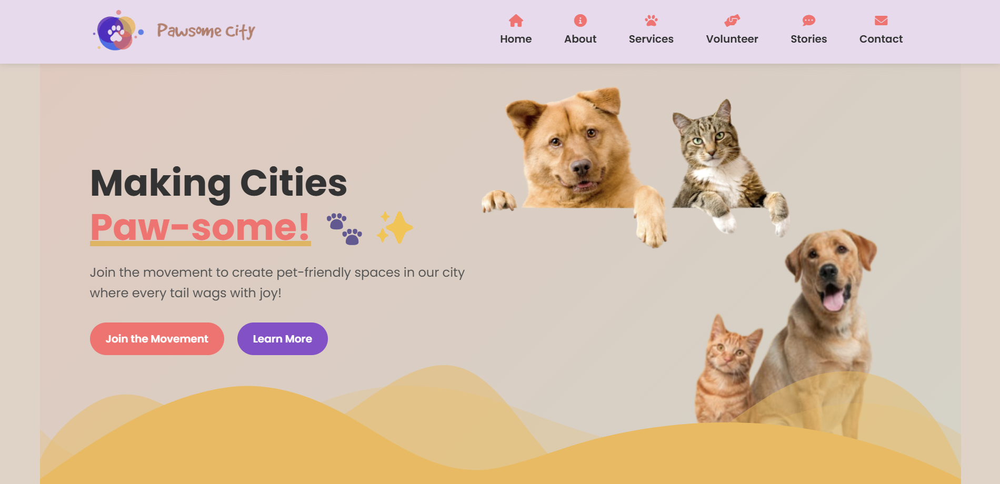
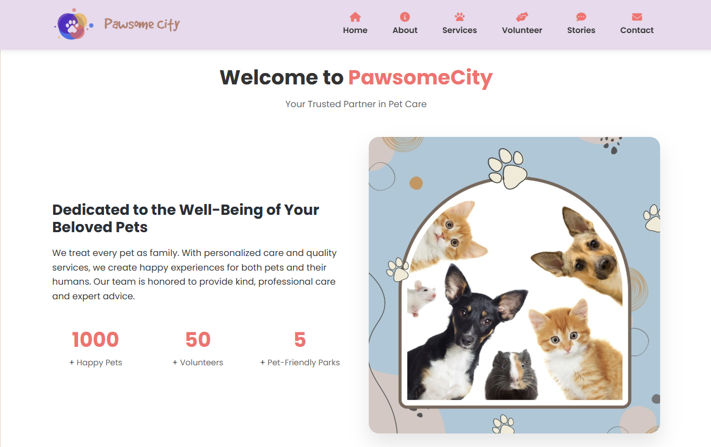

# PawsomeCity: Creating Pet-Friendly Urban Spaces

Website:- [PawsomeCity](https://pawsomecity.netlify.app)

PawsomeCity is a dynamic platform dedicated to making cities more welcoming for pets and their owners. It combines playful design with practical tools to engage communities, promote pet-friendly initiatives, and connect volunteers.

## Key Features:

### Interactive Hero Section:-
Animated floating pets and clear CTAs draw users in, setting a joyful tone.

### Volunteer Sign-Up Form:-
Easy registration for roles like dog walking or event volunteering, with a fun celebration animation upon submission.

https://github.com/user-attachments/assets/e46434f3-ceb4-451d-afd2-f4c7ee7c920e

### Impact Stories Carousel:-
Real testimonials highlight success stories, building trust and community spirit.

### Partner Collaborations:-
Showcases allies like PetFriendlyCity with hover/click descriptions for transparency.

### Pet Services Showcase:-
Clean cards outline offerings (training, sitting, etc.), helping users find resources quickly.

### Mobile-Optimized Navigation:-
Hamburger menu and responsive design ensure accessibility on all devices.

### Engaging Stats Counter:-
Animated numbers (e.g., "1,000+ Happy Pets") visualize impact when scrolling.

### Dark-Themed Contact Section:-
Standout design with social links (Instagram, WhatsApp) for easy connection.

## Why It Works:
PawsomeCity blends fun (like fireworks on sign-up) with function (volunteer tools), creating a community-driven platform that’s as practical as it is uplifting. 
Whether advocating for pet parks or sharing training tips, it empowers users to make cities paw-some—one tail wag at a time. 🐶🐱
